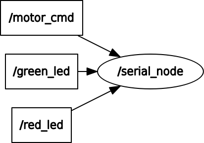
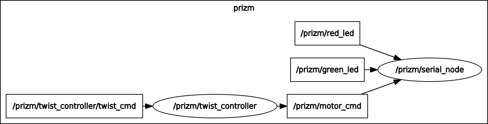

# `prizm_ros`

Unofficial ROS interface package for Tetrix PRIZM motor controller. See below for setup/installation


## Interfaces

### `prizm`



```
$ roslaunch prizm prizm.launch
```

This launch file provides the basic motor controller functionality  

Topics:

  - Publish a `geometry_msgs::Point` on `~/motor_cmd` as the motor controller instruction
    - `x`: motor 1, `y`: motor 2
    - `x` and `y` values must range from `-100` to `100`
  - Publish a `std_msgs::Bool` on `~/red_led` to set the state of the red LED
  - Publish a `std_msgs::Bool` on `~/green_led` to et the state of the green LED

### `twist_controller`



This launch file converts twist messages into direct motor commands.

Topics:

    - Publish a `geometry_msgs::Twist` on `~/twist_controller/twist_cmd` to drive the robot
      - `twist.linear.x`: forward/backward velocity
      - `twist.angular.z`: right/left velocity


# Setup and Installation

Contents (details below):

  1. Setup a ROS  workspace
  2. Install Arduino IDE and ROS support
  3. Clone this repo into your workspace
  4. Upload the motor controller sketch to the Arduino
  4. Point the ROS node to your board


## 1. Setup Workspace

If you haven't already, create a catkin workspace.

```
$ mkdir -p ~/prizm_ws/src
$ cd ~/prizm_ws/src
```


## 2. Arduino

  1. Download and install the [Arduino IDE](https://www.arduino.cc/en/Main/Software).
  2. Open the IDE and close it once it has finished launching. (This creates all the scketchbook directories on your system)
  3. Add serial write permissions. Run `sudo usermod -a -G dialout <UNAME>` where `<UNAME>` is your username.
  4. Restart Computer
  5. Install ROS Support (see below)
  6. Install PRIZM Libraries (follow instructions on [official PRIZM page](https://www.pitsco.com/TETRIX-PRIZM-Component-Set/&TXredir=1))

### Installing ROS Support

[Arduino Setup](http://wiki.ros.org/rosserial_arduino/Tutorials/Arduino%20IDE%20Setup)

Make sure to replace `indigo` with `kinetic` when executing commands. For example, if the pages says to run the command

```
sudo apt-get install ros-indigo-rosserial-arduino
```

then you should run the command

```
sudo apt-get install ros-kinetic-rosserial-arduino
```


## 3. ROS


Clone this repository into the `src` directory.

```
~/prizm_ws/src$ git clone https://github.com/LTU-AutoEV/prizm_ros.git
```

Run `catkin_make` from the workspace directory.

```
~/prizm_ws/src$ cd ..
~/prizm_ws$ catkin_make
~/prizm_ws$ source devel/setup.bash
```

Install dependencies

```
~/prizm_ws$ rosdep install --from-paths src --ignore-src -r -y
```

## 4. Load The Interface onto the Arduino

  1. Open the Arduino IDE
  2. File > Open
    - Open the file `PRIZM_MC.ino` located at `~/prizm_ros/arduino/prizm_MC/` 
  3. Plug in the Arduino and turn on the prizm
  4. Tools -> Port -> (Select your arduino device)
  5. Upload to arduino


## 5. Identify Your Arduino Board

  1. Plug in your Arduino and turn on the prizm
  2. Execute the `detect_arduino.py` script

```
prizm_ws/src/prizm$ ./detect_arduino.py
```

